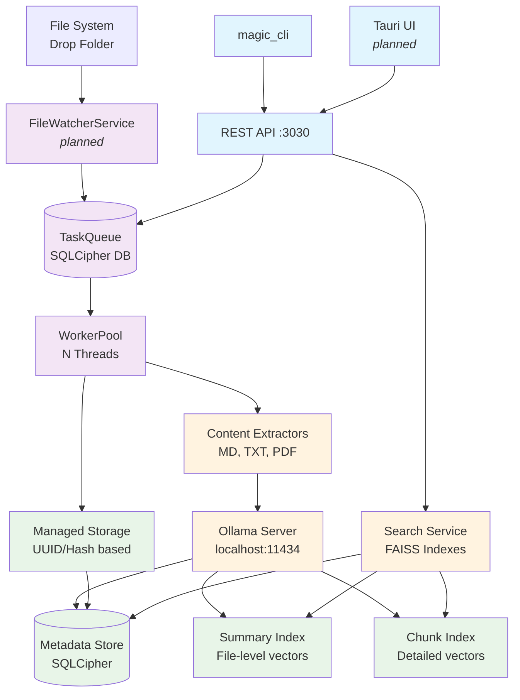

# Magic Folder C++

An intelligent file management system leveraging locally-run LLMs and embedding models to organize and classify your files with an unyielding commitment to privacy and performance.

- Local-first: all processing stays on your machine
- Encrypted at rest: SQLCipher-backed SQLite
- Fast semantic search: FAISS summary + chunk indexes
- Extensible: pluggable extractors, task-based background processing
- Human-friendly organization: tags, virtual folders, symlinks

## Project Status

- Current MVP
  - Chunked file indexing (Markdown + Plaintext)
  - Content hashing (single read: hash + chunk extraction)
  - Embeddings via Ollama (mxbai-embed-large)
  - SQLCipher-encrypted SQLite (macOS Keychain-backed key)
  - zstd-compressed chunk content
  - FAISS-backed two-stage search (files + chunks)
  - Background Worker + WorkerPool processing via task queue
  - REST API + CLI working against a local Ollama server
  - Unit tests with mocks
- Next Phase (in progress/planned)
  - Tauri desktop UI (lightweight, cross-platform)
  - File watching service (producer) + health metrics
  - Additional workers/tasks (retroactive AI tagging, index maintenance, virtual views)
  - PDF extractor and more content types

## Architecture Overview

Magic Folder C++ uses a layered, async design:

- `magic-core`: business logic, task system, extractors, database, vector search
- `magic-api`: REST server + worker pool (consumers)
- `magic-cli`: command-line tool for development and power users
- Tauri UI (planned): Electron-like UX with native webview footprint

### System Architecture



Key runtime components

- FileWatcherService (producer)
  - Watches a single “Drop” inbox folder
  - Debounces/stabilizes file events
  - Enqueues ingest/processing tasks
- TaskQueue (SQLite)
  - Typed columns for common args (target_path, target_tag) + payload JSON for extras
  - Status, priority, retries, timestamps
- WorkerPool (consumers)
  - N threads consume tasks and execute ITask commands
  - Progress reporting via TaskProgress table (and optional SSE)
- Vector indexes
  - Summary index: file-level embeddings
  - Chunk index: on-demand chunk vectors for precision scoring
- Virtual view (symlink layer)
  - By-tag folders, Inbox, All; symlinks/hardlinks to canonical stored files
- Storage (managed library)
  - Opaque, stable storage under UUID/hash with directory fan-out


## Task System

Command pattern with strong typing per task (ITask + concrete tasks). Typed columns in TaskQueue for common args, payload JSON for extras.

Current/Planned task types

- `PROCESS_FILE(target_path | file_id)`
- `INGEST_FILE(target_path)` → move to storage, dedup, enqueue `PROCESS_FILE`
- `RETROACTIVE_TAG(tag_id | target_tag, payload.keywords)`
- `REBUILD_INDEX`
- `REBUILD_VIRTUAL_VIEW`
- `DELETE_FILE(target_path | file_id)`
- `REINDEX_FILE(file_id)`
- `ENSURE_ALIASES_FOR_FILE(file_id)`

### Progress monitoring

- `TaskProgress` table stores `progress_percent`, `status_message`, `updated_at`
- `GET /v1/tasks/{id}` returns live status; optional SSE stream at `/v1/tasks/{id}/events`

## API (MVP + Planned v1)

### MVP (today)

- `POST /process_file` - Queues a file for processing
- `POST /search` - Magic search: returns top-k files and top-k chunks with snippets
- `POST /files/search` - File-only search
- `GET /files` - List indexed files
- `GET /files/{path}` - Get file info (placeholder)
- `DELETE /files/{path}` - Delete file (placeholder)

### Operational Endpoints

- `GET /` - Health check endpoint
  ```json
  {
    "success": true,
    "message": "Magic Folder API is running",
    "version": "0.1.0",
    "status": "healthy"
  }
  ```

- `GET /tasks` - List all tasks (optional `?status=PENDING|PROCESSING|COMPLETED|FAILED`)
  ```json
  {
    "success": true,
    "message": "Tasks retrieved successfully",
    "data": {
      "tasks": [
        {
          "id": 123,
          "task_type": "PROCESS_FILE",
          "status": "PROCESSING",
          "priority": 10,
          "target_path": "/path/to/file.txt",
          "created_at": "2024-01-15T10:30:00Z",
          "updated_at": "2024-01-15T10:31:00Z"
        }
      ],
      "count": 1
    }
  }
  ```

- `GET /tasks/{id}/status` - Get detailed task status
- `GET /tasks/{id}/progress` - Get task progress with percentage and status message
  ```json
  {
    "success": true,
    "message": "Task progress retrieved successfully",
    "data": {
      "task_id": 123,
      "progress_percent": 0.75,
      "status_message": "Processing chunk 1800 of 2400",
      "updated_at": "2024-01-15T10:31:30Z"
    }
  }
  ```

- `POST /tasks/clear` - Clear completed/failed tasks (optional `{"older_than_days": 7}`)

### Planned v1 (stable)

- **Files**
  - `POST /v1/files/import { source_path, process }` → `201 Created` (Location: `/v1/files/{id}`)
  - `GET /v1/files`, `GET /v1/files/{id}`, `DELETE /v1/files/{id}` → `202` with task
  - `POST /v1/files/{id}/process` → `202 Accepted` (Operation-Location: `/v1/tasks/{id}`)
  - `GET /v1/files/{id}/chunks` (debug)
- **Search**
  - `POST /v1/search { query, top_k_files, top_k_chunks, filters }`
- **Tasks**
  - `POST /v1/tasks { type, target_path/target_tag, payload }` → `201`
  - `GET /v1/tasks`, `GET /v1/tasks/{id}`, `GET /v1/tasks/{id}/events`
  - `PATCH /v1/tasks/{id} { cancel | reprioritize }`
- **Tags**
  - `POST /v1/tags { name, keywords? }` → `201`; returns initial candidates + `task_id`
  - `GET /v1/tags`, `GET /v1/tags/{name}`, `GET /v1/tags/{name}/files`
  - `POST /v1/files/{id}/tags { name }`, `DELETE /v1/files/{id}/tags/{name}`
  - `POST /v1/tags/{name}/ai-apply { keywords? }` → `202` task
- **Virtual view**
  - `GET /v1/virtual/root`
  - `POST /v1/virtual/rebuild` → `202`
  - `POST /v1/virtual/ensure-file/{id}`
- **Admin**
  - `GET /v1/health`, `GET /v1/info`
  - `GET /v1/admin/workers`, `POST /v1/admin/workers/pause|resume`
  - `GET /v1/admin/index`, `POST /v1/admin/index/rebuild`

### HTTP semantics

- Synchronous reads → `200 OK`
- Create task resource → `201 Created` (Location header)
- Long-running operations on existing resources → `202 Accepted` (Operation-Location)
- Optional `wait=seconds` to block briefly and return final result if it completes fast

## Development Roadmap

### Phase 1: Chunking + Storage (MVP complete)

- Markdown + plaintext extractors (semantic chunking)
- Chunk/content hashing (single pass)
- zstd compression for chunk content
- SQLCipher SQLite (macOS Keychain key)
- Two-stage search (file → chunk) with FAISS
- Task queue + Worker/WorkerPool
- CLI + REST MVP

### Phase 2: Async + Watcher + Health (Priority)

- **File watching (producer)**
  - Debounce/stability detection; idempotent enqueues
  - Ignore patterns; initial rescan on startup
- **Worker health/metrics**
  - Queue depth, throughput, task age, heartbeats
  - Backoff/retry policies and dead-letter handling
- **Index maintenance**
  - Incremental FAISS updates, background rebuild/compaction
- **Task progress UX**
  - `TaskProgress` table, SSE endpoint; CLI and UI status views

### Phase 3: Content & Tagging

- **PDF extractor** (text + metadata)
- **Code-aware extractor** (function/class boundaries)
- **Retroactive AI tagging**
  - Tag vector creation (keywords, LLM expansion, seed centroid)
  - Coarse (summary index) → fine (chunk scoring) → apply/suggest
  - “Create Tag Folder” that populates live; symlink aliases for auto-applied
- **Virtual views**
  - `by-tag/`, `Inbox/`, `All/`, `by-date/` (optional)

### Phase 4: Tauri UI

- **Desktop UI** (Tauri)
  - Inbox review, tagging, search, “Create Tag Folder”
  - Task monitor with live progress (SSE)
  - Settings (watch paths, thresholds, link mode, worker count)
- **API-first**: UI uses REST; backend remains independent

### Phase 5: Enterprise & Ops

- Docker, CI/CD
- Cross-platform secret storage for DB key
- Multi-user, authZ, audit
- Backup & restore
- Cluster deployment

## 🛠️ Installation & Setup

### Prerequisites (backend)

1.  **C++20 Compatible Compiler**: GCC 10+, Clang 12+, or MSVC 2019+
2.  **CMake**: Version 3.20 or higher
3.  **Ollama**: Local Ollama server with embedding model

### Install Ollama

```bash
curl -fsSL https://ollama.ai/install.sh | sh
ollama pull mxbai-embed-large
ollama serve
```

### Install packages

#### Ubuntu/Debian

```bash
sudo apt update
sudo apt install -y build-essential cmake libcurl4-openssl-dev \
  nlohmann-json3-dev libsqlcipher-dev libfaiss-dev libzstd-dev
```

#### macOS

```bash
brew install cmake curl nlohmann-json sqlcipher faiss zstd
```

#### Windows (vcpkg)

```bash
vcpkg install curl nlohmann-json sqlite3 faiss zstd crow
```

### Build (backend)

```bash
mkdir build && cd build
cmake ..
cmake --build . -j
```

### Optional: Tauri UI (planned)

- Requires Rust toolchain + Node.js (LTS)
- UI runs as separate process, talks to `http://localhost:3030/v1`
- Repo/UI coming in Phase 4

## ⚙️ Configuration

Create `magicrc.json` in project root:

```json
{
  "api_base_url": "127.0.0.1:3030",
  "metadata_db_path": "./data/metadata.db",
  "ollama_url": "http://localhost:11434",
  "embedding_model": "mxbai-embed-large",
  "num_workers": 4,

  "watch": {
    "enabled": false,
    "inbox_root": "./MagicFolder/Drop",
    "recursive": true,
    "settle_ms": 1500,
    "ignore": ["*.tmp", ".DS_Store", "*.part", "*.crdownload", "~*"]
  },

  "storage": {
    "root": "./MagicFolder/Storage",
    "fanout_segments": 2,
    "fanout_chars_per_segment": 2,
    "id_mode": "uuid", // or "sha256"
    "link_mode": "auto" // symlink | hardlink | shortcut | copy | auto
  },

  "virtual_view": {
    "root": "./MagicFolder/View",
    "create_inbox_alias": true,
    "create_all_alias": true
  },

  "tagging": {
    "auto_apply_threshold": 0.85,
    "suggest_threshold": 0.60
  }
}
```

Notes

- On macOS, SQLCipher key is fetched from Keychain. On non-macOS the server
  currently throws when requesting the key (planned cross-platform secret
  storage).
- Windows symlink behavior requires Developer Mode or admin; hardlink is
  preferred when on the same volume.

## Usage

### Start API server

```bash
./bin/magic_api
```

### CLI examples

```bash
export API_BASE_URL=http://127.0.0.1:3030

# Process a file immediately
./bin/magic_cli process --file /path/to/file.txt

# Magic search (files + chunks)
./bin/magic_cli search --query "your query" --top-k 5

# File-only search
./bin/magic_cli filesearch --query "your query" --top-k 5

# List files
./bin/magic_cli list
```

### Task Management & Progress Monitoring

Here's a complete end-to-end workflow showing how to queue a task and monitor its progress:

```bash
# 1. Queue a file for processing (returns immediately)
./bin/magic_cli process --file /path/to/large-document.pdf
# Output: File processing queued successfully

# 2. List all tasks to see what's in the queue
./bin/magic_cli tasks
# Output:
# === Task List ===
# Task ID: 123 | Type: PROCESS_FILE | Status: PENDING
# Target: /path/to/large-document.pdf
# Created: 2024-01-15 10:30:00 | Updated: 2024-01-15 10:30:00

# 3. Check specific task status
./bin/magic_cli task-status --id 123
# Output:
# === Task Status ===
# Task ID: 123
# Type: PROCESS_FILE
# Status: PROCESSING
# Target: /path/to/large-document.pdf
# Created: 2024-01-15 10:30:00
# Updated: 2024-01-15 10:31:15

# 4. Monitor task progress with live updates
./bin/magic_cli task-progress --id 123
# Output:
# === Task Progress ===
# Task ID: 123
# Progress: 75.0%
# Progress: [==============================>         ] 75.0%
# Status: Processing chunk 1800 of 2400
# Updated: 2024-01-15 10:31:30

# 5. Filter tasks by status
./bin/magic_cli tasks --status COMPLETED
./bin/magic_cli tasks --status FAILED

# 6. Clean up old completed tasks
./bin/magic_cli clear-tasks --days 30
```

**Typical Task Lifecycle:**
1. **PENDING** → Task queued, waiting for worker
2. **PROCESSING** → Worker actively processing (chunking, embedding, indexing)
3. **COMPLETED** → Successfully finished, file is searchable
4. **FAILED** → Error occurred, check task status for error message

### Planned UI (Tauri)

- Launch Tauri desktop app to review Inbox, monitor tasks, run searches, create
  tag folders, and manage settings.

## Testing

See TESTING.md. Run test suite:

```bash
./run_tests.sh
```
## Security & Privacy

### Encryption & Data Protection

**Database Encryption (SQLCipher):**
- **Algorithm**: AES-256 in CBC mode with HMAC-SHA256 authentication
- **Backend**: OpenSSL cryptographic primitives (`SQLCIPHER_CRYPTO_OPENSSL`)
- **Key Derivation**: PBKDF2 with SHA256 (default 256,000 iterations)
- **Page Size**: 4096 bytes (SQLCipher default)
- **WAL Mode**: Write-Ahead Logging enabled for performance with encryption

**Key Management:**
- **macOS**: Keys stored in macOS Keychain (`Security.framework`)
  - Service: `com.magicfolder.database_key`
  - Account: `default_user`
  - 256-bit keys generated using `SecRandomCopyBytes`
- **Cross-platform**: Planned support for Windows Credential Store and Linux Secret Service API

**Content Protection:**
- **Chunk Compression**: zstd compression before database storage
- **Vector Storage**: Embeddings stored as encrypted BLOBs in SQLCipher database
- **File Content**: Original files remain in place; only metadata and chunks stored encrypted

### Threat Model

**Protected Against:**
- **Disk Access Attacks**: Full database encryption protects against offline disk analysis
- **Memory Dumps**: Database keys cleared from memory after connection setup
- **Data Exfiltration**: No network calls except to local Ollama server (configurable endpoint)
- **Unauthorized Access**: OS-level keystore integration prevents key extraction without user authentication

**Assumptions & Limitations:**
- **Runtime Security**: Assumes the running process and OS are trusted (no protection against malware with admin/root access)
- **Local Ollama Server**: Communication with Ollama server is over HTTP (localhost only by default)
- **File System**: Original files are not encrypted by Magic Folder (use full-disk encryption like FileVault/BitLocker)
- **Network Boundaries**: API server binds to localhost by default; firewall configuration is user's responsibility

**Privacy Guarantees:**
- **Local-First**: All processing runs locally; no data sent to external services
- **No Telemetry**: No analytics, crash reporting, or usage statistics collected by default
- **Offline Capable**: Works completely offline once Ollama models are downloaded

📄 License

MIT License