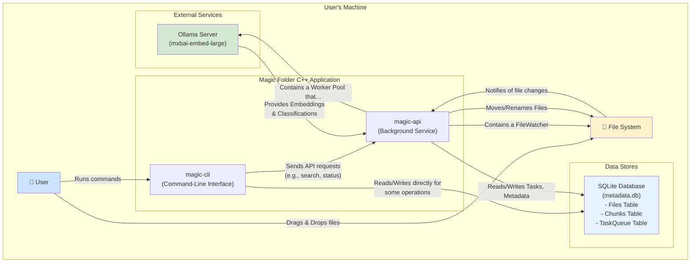
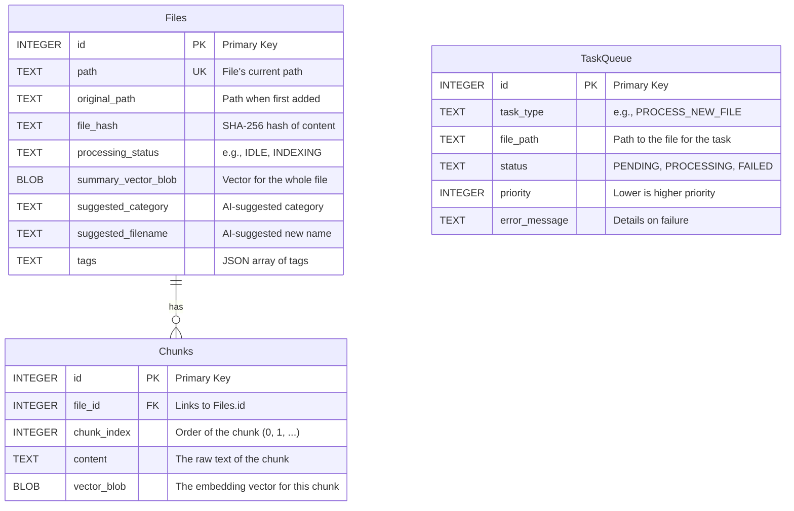
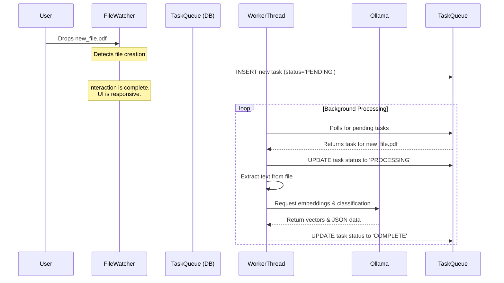
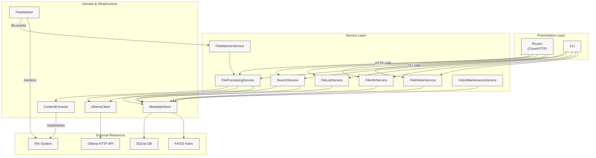
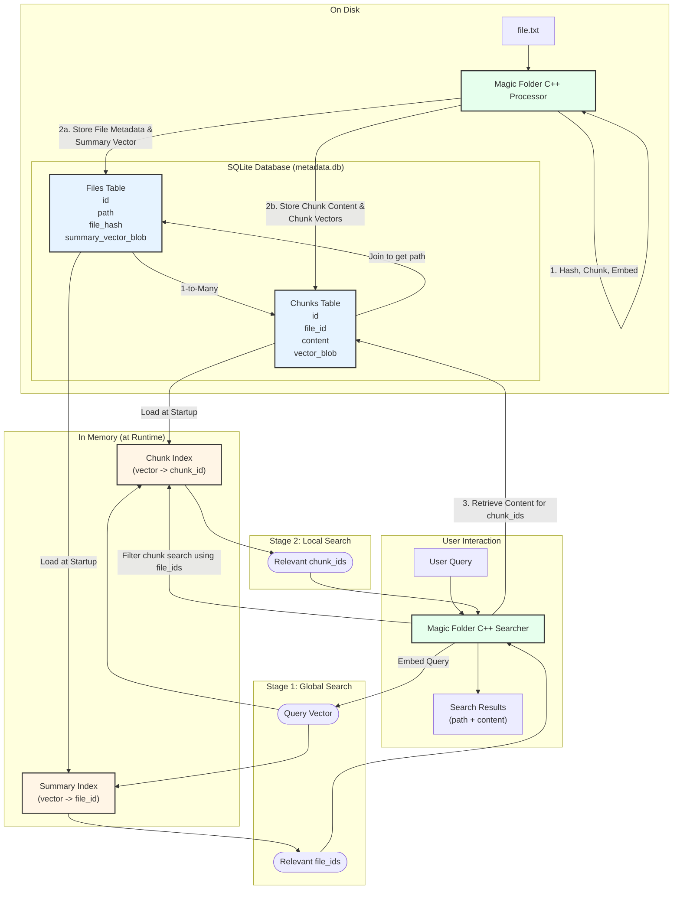
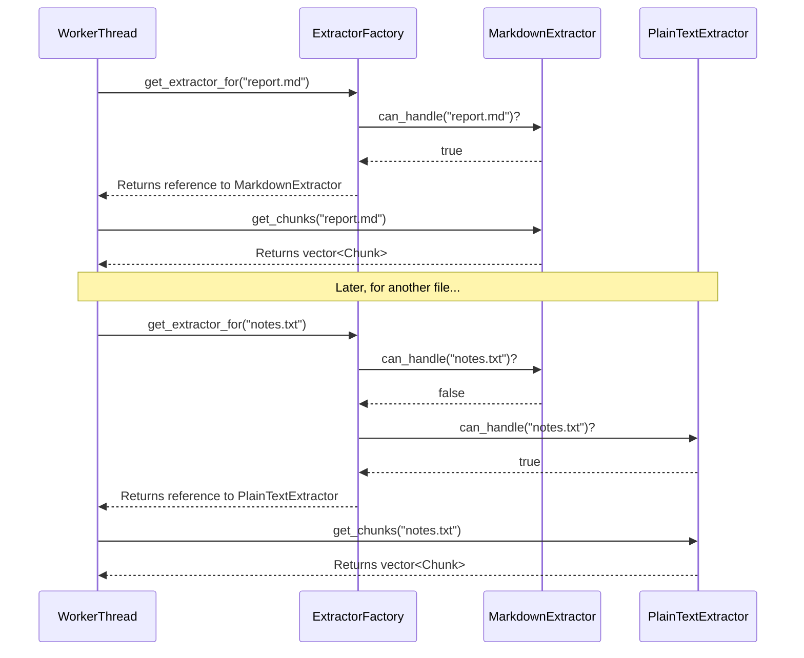

# Component Diagram

```mermaid
graph TD
    subgraph "User's Machine"
        U["👤 User"]
        FS["📁 File System"]

        subgraph "Magic Folder C++ Application"
            CLI["magic-cli\n(Command-Line Interface)"]
            API["magic-api\n(Background Service)"]
        end

        subgraph "Data Stores"
            DB["SQLite Database\n(metadata.db)\n- Files Table\n- Chunks Table\n- TaskQueue Table"]
        end

        subgraph "External Services"
            Ollama["Ollama Server\n(mxbai-embed-large)"]
        end
    end

    U -- "Runs commands" --> CLI
    U -- "Drags & Drops files" --> FS

    CLI -- "Sends API requests\n(e.g., search, status)" --> API
    CLI -- "Reads/Writes directly for\nsome operations" --> DB

    FS -- "Notifies of file changes" --> API
    API -- "Contains a FileWatcher" --> FS

    API -- "Contains a Worker Pool that..." --> Ollama
    API -- "Reads/Writes Tasks, Metadata" --> DB
    API -- "Moves/Renames Files" --> FS

    Ollama -- "Provides Embeddings\n& Classifications" --> API

    style U fill:#cde4ff
    style FS fill:#fff2cc
    style DB fill:#e6f3ff
    style Ollama fill:#d5e8d4
```
# Database Schema

```mermaid
erDiagram
    Files {
        INTEGER id PK "Primary Key"
        TEXT path UK "File's current path"
        TEXT original_path "Path when first added"
        TEXT file_hash "SHA-256 hash of content"
        TEXT processing_status "e.g., IDLE, INDEXING"
        BLOB summary_vector_blob "Vector for the whole file"
        TEXT suggested_category "AI-suggested category"
        TEXT suggested_filename "AI-suggested new name"
        TEXT tags "JSON array of tags"
    }

    Chunks {
        INTEGER id PK "Primary Key"
        INTEGER file_id FK "Links to Files.id"
        INTEGER chunk_index "Order of the chunk (0, 1, ...)"
        TEXT content "The raw text of the chunk"
        BLOB vector_blob "The embedding vector for this chunk"
    }

    TaskQueue {
        INTEGER id PK "Primary Key"
        TEXT task_type "e.g., PROCESS_NEW_FILE"
        TEXT file_path "Path to the file for the task"
        TEXT status "PENDING, PROCESSING, FAILED"
        INTEGER priority "Lower is higher priority"
        TEXT error_message "Details on failure"
    }

    Files ||--o{ Chunks : "has"
```

# Sequence Diagram

```mermaid
sequenceDiagram
    participant User
    participant FileWatcher
    participant TaskQueue (DB)
    participant WorkerThread
    participant Ollama

    User->>FileWatcher: Drops new_file.pdf
    Note over FileWatcher: Detects file creation
    FileWatcher->>TaskQueue: INSERT new task (status='PENDING')
    Note over FileWatcher: Interaction is complete.<br/>UI is responsive.

    loop Background Processing
        WorkerThread->>TaskQueue: Polls for pending tasks
        TaskQueue-->>WorkerThread: Returns task for new_file.pdf
        WorkerThread->>TaskQueue: UPDATE task status to 'PROCESSING'

        WorkerThread->>WorkerThread: Extract text from file
        WorkerThread->>Ollama: Request embeddings & classification
        Ollama-->>WorkerThread: Return vectors & JSON data

        WorkerThread->>TaskQueue: UPDATE task status to 'COMPLETE'
    end
```

# System Diagram

```mermaid
flowchart TD
  %% ───────────────── Presentation Layer ─────────────────
  subgraph "Presentation Layer"
    direction LR
    routes["Routes<br/>(Crow/HTTP)"]
    cli["CLI"]
  end

  %% ───────────────── Service Layer ─────────────────
  subgraph "Service Layer"
    direction TB
    fps["FileProcessingService"]
    ss["SearchService"]
    fls["FileListService"]
    fis["FileInfoService"]
    fds["FileDeleteService"]
    ims["IndexMaintenanceService"]
    fws["FileWatcherService"]
  end

  %% ───────────────── Domain & Infrastructure ─────────────────
  subgraph "Domain & Infrastructure"
    direction TB
    extractor["ContentExtractor"]
    store["MetadataStore"]
    ollama["OllamaClient"]
    watcher["FileWatcher"]
  end

  %% ───────────────── External Resources ─────────────────
  subgraph "External Resources"
    direction TB
    fs["File System"]
    sqlite["SQLite DB"]
    faiss["FAISS Index"]
    ollamaAPI["Ollama HTTP API"]
  end

  %% Presentation → Services
  routes -->|"HTTP calls"| fps
  routes --> ss
  routes --> fls
  routes --> fis
  routes --> fds

  cli -->|"CLI calls"| fps
  cli --> ss
  cli --> fls
  cli --> fis
  cli --> fds

  %% File-system events
  watcher -- "file events" --> fws
  fws --> fps

  %% Services → Domain objects
  fps --> extractor
  fps --> ollama
  fps --> store

  ss  --> ollama
  ss  --> store

  fls --> store
  fis --> store
  fds --> store
  ims --> store

  %% Domain → External resources
  extractor -- "reads/writes" --> fs
  watcher -- "monitors" --> fs
  store --> sqlite
  store --> faiss
  ollama --> ollamaAPI

  %% Optional styling for readability
  classDef layer fill:#f7f7f7,stroke:#333,stroke-width:1px;
  class routes,cli,fps,ss,fls,fis,fds,ims,fws,extractor,store,ollama,watcher,fs,sqlite,faiss,ollamaAPI layer;
```

# Chunking Logic Diagram

```mermaid
graph TD
    subgraph "On Disk"
        A[file.txt] --> B[Magic Folder C++ Processor]
        subgraph "SQLite Database (metadata.db)"
            T1[Files Table\nid\npath\nfile_hash\nsummary_vector_blob]
            T2[Chunks Table\nid\nfile_id\ncontent\nvector_blob]
            T1 -- "1-to-Many" --> T2
        end
    end

    subgraph "In Memory (at Runtime)"
        IM1["Summary Index\n(vector -> file_id)"]
        IM2["Chunk Index\n(vector -> chunk_id)"]
    end

    subgraph "User Interaction"
        U[User Query] --> S[Magic Folder C++ Searcher]
        S --> R["Search Results\n(path + content)"]
    end

    %% Indexing Flow
    B -- "1. Hash, Chunk, Embed" --> B
    B -- "2a. Store File Metadata &\nSummary Vector" --> T1
    B -- "2b. Store Chunk Content &\nChunk Vectors" --> T2

    %% Load at Startup Flow
    T1 -- "Load at Startup" --> IM1
    T2 -- "Load at Startup" --> IM2

    %% Search Flow
    S -- "Embed Query" --> Q_VEC([Query Vector])

    subgraph "Stage 1: Global Search"
        Q_VEC --> IM1
        IM1 --> F_IDS([Relevant file_ids])
    end

    subgraph "Stage 2: Local Search"
        F_IDS --> S
        Q_VEC --> IM2
        S -- "Filter chunk search using file_ids" --> IM2
        IM2 --> C_IDS([Relevant chunk_ids])
    end

    C_IDS --> S
    S -- "3. Retrieve Content for chunk_ids" --> T2
    T2 -- "Join to get path" --> T1

    classDef db fill:#e6f3ff,stroke:#333,stroke-width:2px
    class T1,T2 db
    classDef memory fill:#fff5e6,stroke:#333,stroke-width:2px
    class IM1,IM2 memory
    classDef process fill:#e6ffed,stroke:#333,stroke-width:2px
    class B,S process

```

# Chunking Sequence Diagram

```mermaid
sequenceDiagram
    participant WorkerThread
    participant ExtractorFactory
    participant MarkdownExtractor
    participant PlainTextExtractor

    WorkerThread->>ExtractorFactory: get_extractor_for("report.md")
    ExtractorFactory->>MarkdownExtractor: can_handle("report.md")?
    MarkdownExtractor-->>ExtractorFactory: true
    ExtractorFactory-->>WorkerThread: Returns reference to MarkdownExtractor

    WorkerThread->>MarkdownExtractor: get_chunks("report.md")
    MarkdownExtractor-->>WorkerThread: Returns vector<Chunk>

    %% Second scenario for a different file type
    Note over WorkerThread, PlainTextExtractor: Later, for another file...

    WorkerThread->>ExtractorFactory: get_extractor_for("notes.txt")
    ExtractorFactory->>MarkdownExtractor: can_handle("notes.txt")?
    MarkdownExtractor-->>ExtractorFactory: false
    ExtractorFactory->>PlainTextExtractor: can_handle("notes.txt")?
    PlainTextExtractor-->>ExtractorFactory: true
    ExtractorFactory-->>WorkerThread: Returns reference to PlainTextExtractor

    WorkerThread->>PlainTextExtractor: get_chunks("notes.txt")
    PlainTextExtractor-->>WorkerThread: Returns vector<Chunk>
```