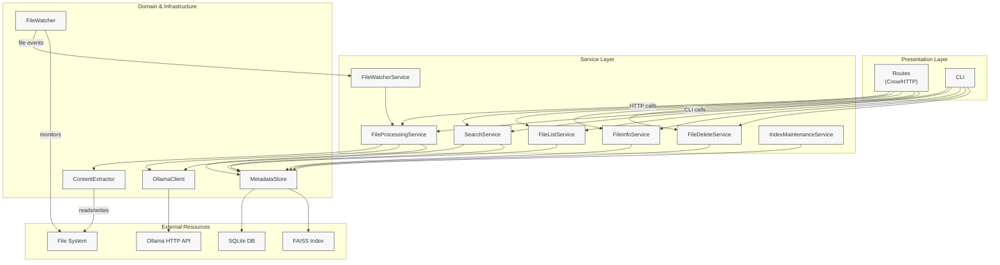

```mermaid
flowchart TD
  %% ───────────────── Presentation Layer ─────────────────
  subgraph "Presentation Layer"
    direction LR
    routes["Routes<br/>(Crow/HTTP)"]
    cli["CLI"]
  end

  %% ───────────────── Service Layer ─────────────────
  subgraph "Service Layer"
    direction TB
    fps["FileProcessingService"]
    ss["SearchService"]
    fls["FileListService"]
    fis["FileInfoService"]
    fds["FileDeleteService"]
    ims["IndexMaintenanceService"]
    fws["FileWatcherService"]
  end

  %% ───────────────── Domain & Infrastructure ─────────────────
  subgraph "Domain & Infrastructure"
    direction TB
    extractor["ContentExtractor"]
    store["MetadataStore"]
    ollama["OllamaClient"]
    watcher["FileWatcher"]
  end

  %% ───────────────── External Resources ─────────────────
  subgraph "External Resources"
    direction TB
    fs["File System"]
    sqlite["SQLite DB"]
    faiss["FAISS Index"]
    ollamaAPI["Ollama HTTP API"]
  end

  %% Presentation → Services
  routes -->|"HTTP calls"| fps
  routes --> ss
  routes --> fls
  routes --> fis
  routes --> fds

  cli -->|"CLI calls"| fps
  cli --> ss
  cli --> fls
  cli --> fis
  cli --> fds

  %% File-system events
  watcher -- "file events" --> fws
  fws --> fps

  %% Services → Domain objects
  fps --> extractor
  fps --> ollama
  fps --> store

  ss  --> ollama
  ss  --> store

  fls --> store
  fis --> store
  fds --> store
  ims --> store

  %% Domain → External resources
  extractor -- "reads/writes" --> fs
  watcher -- "monitors" --> fs
  store --> sqlite
  store --> faiss
  ollama --> ollamaAPI

  %% Optional styling for readability
  classDef layer fill:#f7f7f7,stroke:#333,stroke-width:1px;
  class routes,cli,fps,ss,fls,fis,fds,ims,fws,extractor,store,ollama,watcher,fs,sqlite,faiss,ollamaAPI layer;
```